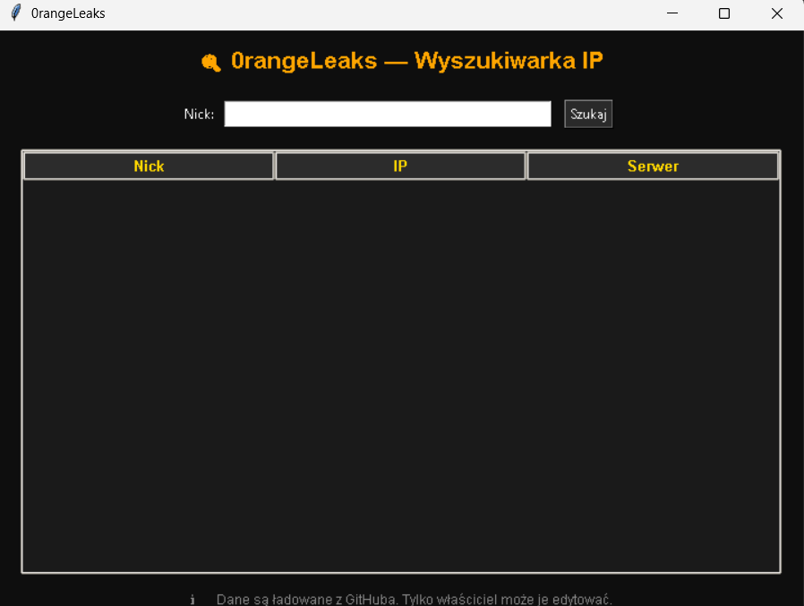

# 🟠 OrangeLeaks v1.0 — Wyszukiwarka IP graczy

> Aplikacja do lokalizacji IP graczy na podstawie nicku — dane ładowane dynamicznie z serwera.  
> **Tylko właściciel może aktualizować listę IP.**

---

## 📥 Jak pobrać i uruchomić?

1. Wejdź w [Releases](https://github.com/Orange2137/OrangeLeaks-app/releases)
2. Pobierz `OrangeLeaks.exe`
3. Uruchom aplikację
4. Wpisz nick gracza → zobacz IP i serwer

> ⚠️ **Wymaga Windowsa.**

---

## 🌐 Dane są ładowane z:

🔗 [OrangeLeaks-data](https://github.com/0range2137/0rangeLeaks-data)

---

## 🖥️ Interfejs

---

## 🛡️ Ostrzeżenie

> Aplikacja przeznaczona **wyłącznie do celów edukacyjnych**.  
> Nie używaj do ataków, DDoS, stalking'u ani innych działań niezgodnych z prawem.

---

## 💬 Kontakt

- Discord: `0range__2137`

---

## 📜 Licencja

MIT License — szczegóły w pliku [LICENSE](https://github.com/0range2137/0rangeLeaks-app/blob/main/LICENSE.txt).
